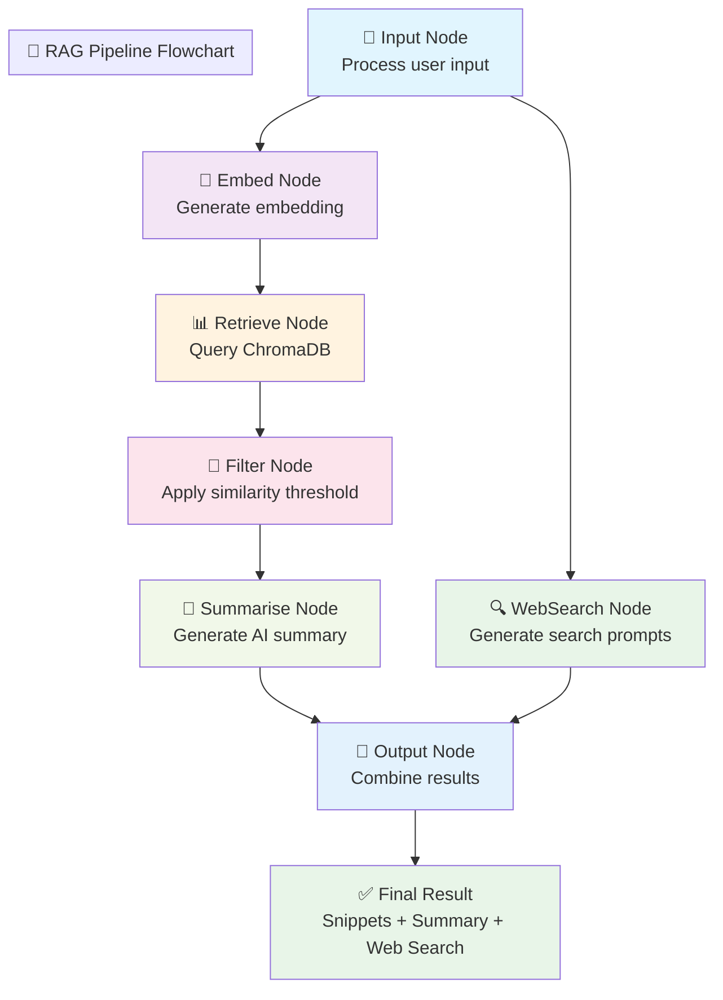

```mermaid
graph TD
    subgraph TITLE["🔁 RAG Pipeline Flowchart"]
    end

    A["🚀 Input Node<br/>Process user input"] --> B["🧠 Embed Node<br/>Generate embedding"]
    A --> C["🔍 WebSearch Node<br/>Generate search prompts"]
    B --> D["📊 Retrieve Node<br/>Query ChromaDB"]
    D --> E["🔬 Filter Node<br/>Apply similarity threshold"]
    E --> F["📝 Summarise Node<br/>Generate AI summary"]
    F --> G["🎉 Output Node<br/>Combine results"]
    C --> G
    G --> H["✅ Final Result<br/>Snippets + Summary + Web Search"]
    
    style A fill:#e1f5fe
    style B fill:#f3e5f5
    style C fill:#e8f5e8
    style D fill:#fff3e0
    style E fill:#fce4ec
    style F fill:#f1f8e9
    style G fill:#e3f2fd
    style H fill:#e8f5e8
``` 